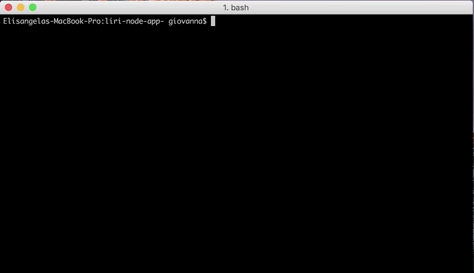
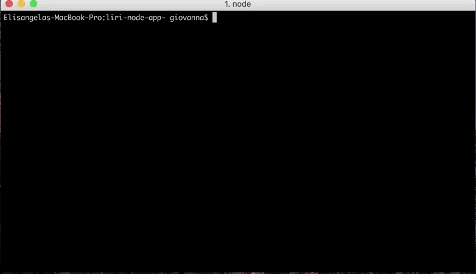

# Liri Bot 
LIRI is like iPhone's SIRI. However, while SIRI is a Speech Interpretation and Recognition Interface, LIRI is a Language Interpretation and Recognition Interface. 

## Instructions
---
The user can either use the prompt or the commands in the terminal/bash window to receive the data.

### Commands:
---
The LIRI recognizes the followings commands:
- `my-tweets`

- `spotify-this-song <song name here>'`

- `movie-this '<movie name here>'`

- `do-what-it-says`

 

#### Spotify
---
LIRI will use the Spotify NPM Package in order to retrieve the information. Maximum of 5 songs will be displayed. If no information is provided the LIRI will default to "The Sign" by Ace of Base. 
- Artist(s)
- The song's name
- A preview link of the song from Spotify
- The album that the song is from

#### Twitter 
---
LIRI will use the Twitter NPM Package in order to display the last 20 tweets and when they were created.

#### OMDB 
---
LIRI will use the Request NPM Package to output the following informations:
- Title of the movie.
- Year the movie came out.
- IMDB Rating of the movie.
- Rotten Tomatoes Rating of the movie.
- Country where the movie was produced.
- Language of the movie.
- Plot of the movie.
- Actors in the movie.

 If no information is provided the LIRI will default to "Mr. Nobody" movie.

#### FS
---
Using the FS Node Package, LIRI will take the text inside of random.txt and then use it to call the Spotify command.

